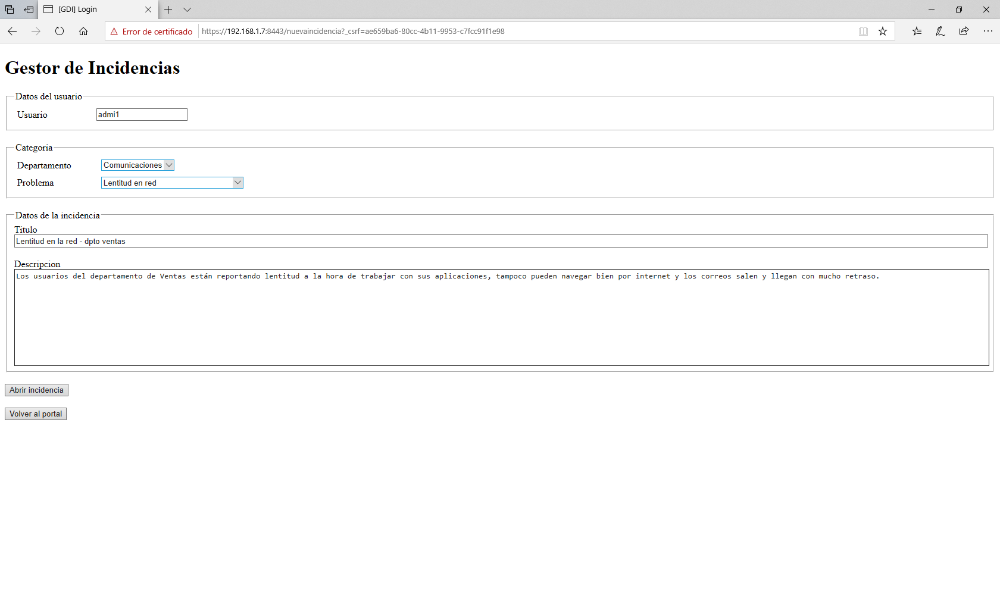

# Gestor de Incidencias (GDI)

Proyecto para la asignatura de Desarrollo de Aplicaciones Distrubuidas, 3º de GIC en la URJC

- [Fase 1 - Equipo de desarrollo y tematica de la web](#Fase-1---Equipo-de-desarrollo-y-tematica-de-la-web)
	- [Descripcion de la aplicacion](#Descripcion-de-la-aplicacion)
	- [Descripcion de las entidades](#Descripcion-de-las-entidades)
	- [Descripcion del servicio interno](#Descripcion-del-servicio-interno)
- [Fase 2 - Desarrollo de la aplicacion web en local](#Fase-2---Desarrollo-de-la-aplicacion-web-en-local)
	- [Paginas de la aplicacion](#Paginas-de-la-aplicacion)
	- [Modelo Entidad Relacion](#Modelo-Entidad-Relacion)
	- [Diagrama de clases UML](#Diagrama-de-clases-UML)
- [Fase 3 - Inclusion de seguridad y servicio interno](#Fase-3---Inclusion-de-seguridad-y-servicio-interno)
	- [Cambios realizados sobre las Fases 2 y 3](#Cambios-realizados-sobre-las-Fases-2-y-3)
	- [Paginas de la aplicacion actualizadas](#Paginas-de-la-aplicacion-actualizadas)
	- [Navegacion entre paginas](#Navegacion-entre-paginas)
	- [Modelo Entidad Relacion actualizado](#Modelo-Entidad-Relacion-actualizado)
	- [Diagrama de clases UML actualizado](#Diagrama-de-clases-UML-actualizado)
	- [Comandos de instalacion y ejecucion en una VM limpia](#Comandos-de-instalacion-y-ejecucion-en-una-VM-limpia)
		-[Comandos para la instalacion de MySQL Server](#Comandos-para-la-instalacion-de-MySQL-Server)
		-[Comandos para la instalacion de Java](#Comandos-para-la-instalacion-de-Java)
		-[Comandos para lanzar la aplicacion y el servicio interno](#Comandos-para-lanzar-la-aplicacion-y-el-servicio-interno)
- [Fase 4 - Incluir tolerancia a fallos en la aplicacion](#Fase-4---Incluir-tolerancia-a-fallos-en-la-aplicacion)
- [Fase 5 - Automatizar el despliegue de la aplicacion](#Fase-5---Automatizar-el-despliegue-de-la-aplicacion)

## Fase 1 - Equipo de desarrollo y tematica de la web

Alumno: Miguel Fernández Domínguez

Correo: m.fernandezdo@alumnos.urjc.es

### Descripcion de la aplicacion

La aplicación a desarrollar es una web para gestion de indicencias en una empresa tipo PYME, donde el número de empleados permite que que esta herramienta no sea demasiado complicada, aportando una funcionalidad básica accesible a usuarios con cualquier nivel de conocimientos en informática.

### Descripcion de las entidades

Interactuarán con la aplicación varios tipos de personas:

* Usuario: Puede ser cualquier persona dentro de la empresa que desee reportar un problema abriendo una incidencia
* Técnico: Aquellos empleados de la empresa encargados de atender y solucionar las incidencias de los usuarios
* Administrador: Usuario con privilegios en la aplicación, puede dar de alta o baja a un técnico, reabrir incidencias cerradas, modificar o borrar comentarios y descripciones...
	
Las incidencias estarán compuestas por:

* Título: Un texto breve que normalmente dará una idea global del problema
* Descripción: Descripción que hace el usuario sobre el problema que tiene
* Comentarios: Anotaciones que van realizando los técnicos según van avanzando en la resolución de la incidencia
* Solución: Breve descripción de las acciones realizadas para solucionar el problema.
* Adjuntos: Tanto usuarios como técnicos podrán adjuntar ficheros de texto o capturas de pantalla que ayuden a documentar la incidencia.

Durante la apertura de la incidencia habrá que categorizarla para que los técnicos puedan priorizarlas a la hora de atenderlas. Para realizar esta categorización se indicará un departamento y un tipo de problema. Algunas de estas categorias y subcategorias serán:

+ Correo
	+ Alta de correo
	+ Baja de correo
	+ Recuperacion de correos
	+ Recepcion de correo malicioso
	+ Recepcion Spam
	+ Problema al enviar correos
	+ Problema al recibir correos
+ Ventas
	+ SW ventas no funciona
	+ SW ventas funciona muy lento
	+ SW Ventas no guarda datos
	+ SW Ventas no recupera datos
	+ Recuperacion de archivos historicos
+ Microinformatica
	+ No funciona la pantalla
	+ No funciona el raton
	+ No funciona el teclado
	+ Entrega de PC
	+ Retirada de PC
	+ Instalacion de SW ofimatico
	+ Revision de configuracion de SW
+ RRHH
	+ Alta empleado
	+ Baja empleado
	+ SW RRHH no funciona
	+ SW RRHH funciona muy lento
+ Sistemas
	+ Ampliacion espacio de disco

+ Llenado de disco
	+ Caida de servidor
	+ Caida de proceso
	+ Antivirus
	+ Ampliacion recursos de servidor
	+ Retirada de servidor
+ BBDD
	+ Caida BD
	+ Caida Listener
	+ Llenado de archivers
	+ Lentitud en consultas
+ Comunicaciones
	+ Caida de red
	+ Lentitud en red
	+ Error en llamadas entrantes
	+ Error en llamadas salientes
	+ Linea de datos principal caida
	+ Linea de datos backup caida
	
En la parte publica de la web se mostrará una ventana de login para cualquier usuario y en función de que tipo de usuario se conecte se mostrará lo siguiente:
	
* Usuario: Podrá abrir una nueva incidencia, consultar aquellas que tuviese abiertas, añadir comentarios y cerrar de forma definitiva sus incidencias, si está de acuerdo con la solución, cuando se las resuelvan los técnicos.
* Tecnico: Verá la cola de incidencias ordenada por criticidad, podrá asignarse incidencias a su nombre, añadir comentarios a las incidencias, modificar la descripción y el título, escribir sobre el campo solución y solucionar incidencias.
* Administrador: Tendrá una vista similar a la de un técnico pero con más privilegios, pudiendo borrar comentarios y reabrir incidencias cerradas por el usuario.

### Descripcion del servicio interno

El servicio interno realizará la siguiente tarea:

* Enviará un correo de notificación a los usuarios cuando su incidencia se resuelva.

## Fase 2 - Desarrollo de la aplicacion web en local

### Paginas de la aplicacion

A continuación se muestran las páginas de la aplicación según los perfiles de usuario de Técnico/Admistrador, que son los que pueden ver todos los elementos sin resticciones.

En primer lugar tenemos la página de Login:

Desde ella un usuario introducirá un nombre de usuario y password y seleccionará un perfil (usuario, tecnico o administrador) y se conectará a la aplicación mostrándo la siguiente página de bienvenida:

Aquí se ofrecen dos opciones a todos los usuarios, abrir una nueva incidencia o hacer una consulta de una incidencia a través de su Id. En caso de que el usuario sea un técnico o un administrador, además se mostrárá una tabla con las incidencias del sistema. Estos usuarios podrán acceder a estas o bien usando el cuadro de búsqueda comentado antes o pinchando en el hiperenlace del Id de la incidencia.

Si elegimos abrir una nueva incidencia se cargara el siguiente formulario:

Aquí se nos solicitarán los datos necesarios para abrir una nueva incidencia.

Si deseamos consultar una incidencia se mostrará esta otra web:

En esta página los usuarios podrán ver la información de la incidencia, junto con los avances que se hayan podido llevar a cabo visibles en la tabla de comentarios y en el campo solución, también podrá añadir comentarios a la incidencia si fuera necesario y cerrar la incidencia si esta está solucionada y el usuario está de acuerdo con ello. Los técnicos y administradores podrán asignarse incidencias para resolverlas, añadir comentarios y solucionarlas, un administrador podrá, además, modificar y borrar comentarios, y reabrir incidencias que se encuentren cerradas.

Si un administrador quiere actuar sobre un comentario, podrá acceder a él pinchando en el hipervínculo de su Id con lo que accederá a la siguiente página:

Desde aquí podrá modificar el texto de una anotación o borrar el comentario por completo y hacer esos cambios efectivos.

### Modelo Entidad Relacion

### Diagrama de clases UML

## Fase 3 - Inclusion de seguridad y servicio interno

En esta fase se ha llevado a cabo:
* La implementación de la seguridad https + CSRF usando Spring Security
* La implementación de un servicio interno, creado como una aplicación nueva, con el que se comunicará el Gestor de Incidencias cada vez que un técnico o administrador solucione una incidencia. Este servicio interno enviará un email al usuario informando que su incidencia ha sido resuelta.
	* El código del servicio interno puede ser consultado en el siguiente repositorio de GitHub: [Servicio interno](https://github.com/miguelferdom/GestorDeIncidenciasServicioInterno)
	* El envío de correos se hace a través de la cuenta de Gmail gdi.servicio.interno@gmail.com
* Entrega de la aplicación + servicio interno + bd corriendo en una máquina virtual (Ubuntu server 16.04 LTS 64bits ejecutándose sobre VirtualBox).

### Cambios realizados sobre las Fases 2 y 3

Para poder llevar a cabo los requisitos de la Fase 3 se han tenido que modificar el diseño de algunas de las páginas entregadas en la fase 2 además de tener que cambiar y añadir algunos atributos más en la entidad Usuario de la BD. Estos cambios los dejaremos reflejados con nuevas capturas de pantalla de las páginas de la aplicación y del diagrama ER y modelo UML.

Se añade a Usuario un campo email para recibir los correos que le envie el servicio interno.
Se modifica el atributo perfil de Usuario para que ahora sea una lista de roles ("ROLE_usuario", "ROLE_tecnico" y "ROLE_administrador") según los cuales tendrá mas o menos funcionalidades dentro de la aplicación.

### Paginas de la aplicacion actualizadas

A continuación se muestran las páginas de la aplicación actualizadas para un perfil de Admistrador son los que pueden ver todos los elementos sin resticciones, también mostraremos una página de bienvenida de un usuario donde se ve que los usuarios solo ven las incidencias que ellos han creado.

La página incial de la aplicación será la de login:

Desde ella un usuario introducirá un nombre de usuario y password y se conectará a la aplicación, si se introducen unas credenciales incorrectas se le redirigira a la página de loginerror:

Si las credenciales son correctas se cargara la página de bienvenida en función de su rol:

Un usuario verá solo sus incidencias:

Un técnico o un administrador verá todas las incidencias ordenadas por su criticidad:
 

Desde esta página se ofrecen varias opciones, abrir una nueva incidencia, hacer una consulta de una incidencia a través de su Id o salir de la aplicación haciendo logout.

Si elegimos hacer logout se carga la siguiente web que nos permite volver a la página de login:

Si elegimos abrir una nueva incidencia, se cargará el siguiente formulario:

Y por último si elegimos consultar una incidencia:

Desde está página, si somos técnicos o administradores además podremos acceder a la información de los comentarios para modificarlos o borrarlos (solo administradores):

Los técnicos o administradores también podrán solucionar incidencias lo que hará que se envie la información de estas al servicio interno y se mande un correo, como el que sigue, informando al usuario que la abrió:

### Navegacion entre paginas

### Modelo Entidad Relacion actualizado

### Diagrama de clases UML actualizado

### Comandos de instalacion y ejecucion en una VM limpia

Para este apartado se entiende como Máquina Virtual limpia un Ubuntu Server 16.04 LTS 64bits (con 2 procesadores asignados, 4096Mb de RAM y 30Gb de HD asignado de forma dinámica) recien instalado al que se le han aplicado los siguientes cambios mínimos:

* Instalación de un cliente/servidor ssh durante la instalación
* Instalación del paquete build-essential para necesario para instalar a su vez las guest additions de VirtualBox, necesarias a su vez para poder compartir una carpeta con el sistema Host Windows 10 sobre el que corren las VM's levantadas por VirtualBox
* Creación y configuracion de la carpeta /compartida para el intercambio de archivos con el Host Windows 10.

Se elije esta version de Ubuntu server ya que las versiones que instala de java (1.8) y MySQL Server (5.7) son compatibles con las usadas hasta el momento en el desarro de la aplicación en una máquina fisica (java 1.8 y MySQL Server 5.5)

#### Comandos para la instalacion de MySQL Server

Instalación de MySQL Server:

sudo apt-get update
sudo apt-get install mysql-server
(durante la instalación se pide teclear la passwor de root para mysql 2 veces, introducir 1234)

Para verificar que el servicio de MySQL esta levantado:

sudo service mysql status

Para parar o arrancar el servicio de MySQL:

sudo service mysql stop
sudo service mysql start

Con MySQL Server ya instalado debemos crear la instacia de nuestra base de datos:

sudo /usr/bin/mysql -u root -p
(introducimos las passwords para el comando sudo y luego para el root de mysql)

Y una vez nos hemos conectado a la consola de MySQL:
mysql> CREATE DATABASE gdidb;
mysql> exit;

#### Comandos para la instalacion de Java

Instalación de Java 8

sudo apt-get update
sudo apt-get install openjdk-8-jre

Para verificar la version de java instalada:

java -version

#### Comandos para lanzar la aplicacion y el servicio interno

Ejecución de la aplicación y del servicio interno:

java -jar gdi-0.0.1-SNAPSHOT.jar &
java -jar GestorDeIncidenciasServicioInterno-0.0.1-SNAPSHOT.jar &

## Fase 4 - Incluir tolerancia a fallos en la aplicacion

## Fase 5 - Automatizar el despliegue de la aplicacion
